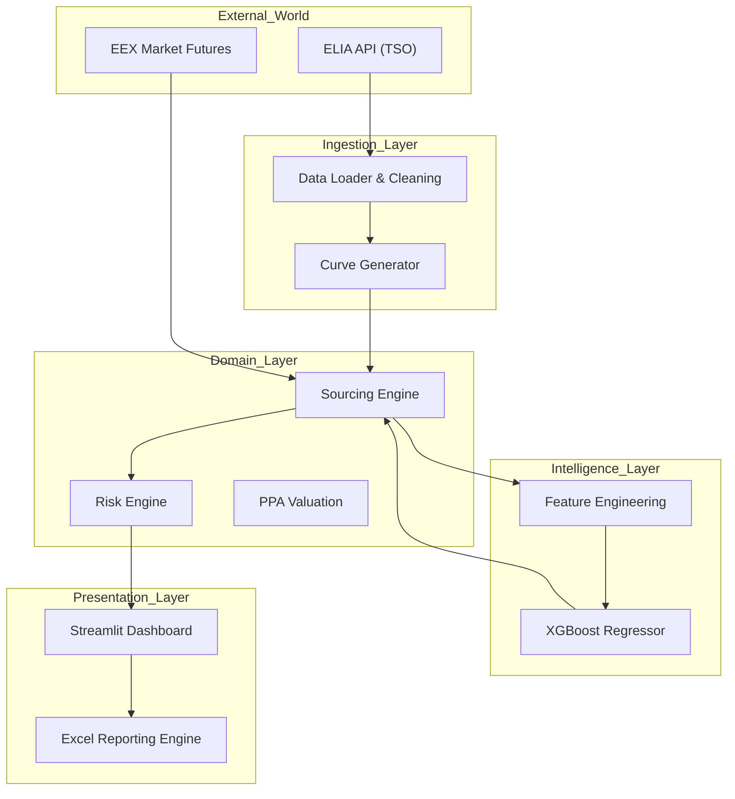

# Voltage Pricer™ – Enterprise Energy Quoting Engine

An industrial-grade pricing engine designed for B2B Power & Gas suppliers, bridging Wholesale Markets (EEX) and Retail Offers through stochastic modeling and advanced risk valuation.

---

## Table of Contents

- Executive Summary  
- System Architecture  
- Microservices Design  
- Data Flow Diagram  
- Quantitative Framework (The Math)  
- Machine Learning Forecasting (XGBoost)  
- Hourly Price Forward Curve (HPFC)  
- Profiling Cost Valuation  
- Volume Risk Premium  
- Renewable PPA Cannibalization  
- Technical Implementation  
- Data Ingestion Layer  
- Domain Logic Layer  
- Reporting Layer  
- Interface & UX  
- Installation & Deployment  
- Project Structure  

---

## 1. Executive Summary

**Voltage Pricer** is a Python-based valuation engine simulating the workflow of a Pricing Analyst at a major utility (e.g., TotalEnergies, Engie). Unlike simple arithmetic calculators, it implements a **bottom-up approach** to energy pricing:

- **Real-Time Grid Integration**  
  Connects to the ELIA (Belgian TSO) Open Data API to ingest real-time load curves and spot prices, ensuring the pricing is grounded in physical reality.

- **AI-Driven Seasonality**  
  Utilizes a Gradient Boosting Regressor (XGBoost) trained on 25 years of synthetic history to forecast hourly price shapes (HPFC) for future delivery years (Cal-26).

- **Risk Quantification**  
  Explicitly computes the Profiling Cost (Shape Risk) and Volume Swing Risk to protect the supplier's margin against consumption volatility.

---

## 2. System Architecture

The project adopts a **Hexagonal Architecture (Ports & Adapters)** to decouple the business logic (Pricing / Risk) from the infrastructure (API / UI / Data Sources).

---

### 2.1 Microservices Design

The application is containerized and split into modular components:

- **Ingestion Service**  
  Handles external API calls (ELIA) and data normalization.

- **Forecasting Service**  
  Manages the XGBoost model lifecycle (training / inference).

- **Pricing Core**  
  Pure Python implementation of the valuation formulas.

- **Presentation Layer**  
  Streamlit dashboard acting as the B2B Sales Front-end.

---

### 2.2 Data Flow Diagram



## 3. Quantitative Framework (The Math)

### 3.1 Machine Learning Forecasting (XGBoost)

The model predicts the **hourly price shape** based on temporal features.

- **Objective**: Minimize RMSE on historical hourly prices  
- **Features**:  
  `Hour`, `DayOfWeek`, `Month`, `IsWeekend`, `IsPeak`
- **Algorithm**: Gradient Boosting Trees  
  - 200 estimators  
  - `max_depth = 7`

---

### 3.2 Hourly Price Forward Curve (HPFC)

The Hourly Price Forward Curve aligns the ML-generated hourly shape with the market forward level.

\[
HPFC_t = \hat{P}_t^{ML} + \left(P_{Market}^{Forward} - \mu(\hat{P}^{ML})\right)
\]

Where:

- $\hat{P}_t^{ML}$ is the ML-predicted hourly price  
- $P_{Market}^{Forward}$ is the Cal forward baseload price  
- $\mu(\cdot)$ is the mean of the ML-generated curve  

---

### 3.3 Profiling Cost Valuation

The profiling cost measures **shape risk**, i.e. the tendency to consume more electricity during structurally high-price hours.

\[
Cost_{Profiling} =
\left(
\frac{\sum_{t=1}^{8760} (Load_t \times HPFC_t)}
{\sum_{t=1}^{8760} Load_t}
\right)
- \bar{P}_{Base}
\]

A positive value indicates a consumption profile more expensive than the flat baseload hedge.

---

### 3.4 Volume Risk Premium

To cover **swing risk** (volume deviation from forecast), a simplified option-like premium is applied.

\[
Premium = (Base + 5 \cdot \sigma_{spot}) \times SizeFactor(V)
\]

Where:

- $\sigma_{spot}$ is spot price volatility  
- $V$ is annual client volume  

---

### 3.5 Renewable PPA Cannibalization

For renewable PPAs (Solar / Wind), the fixed price is discounted to reflect capture effects.

\[
P_{PPA} = (P_{Base} \times CR) - RiskBuffer
\]

This accounts for production/price correlation and cannibalization during high renewable output periods.

---

## 4. Technical Implementation

### 4.1 Data Ingestion Layer

**File:** `src/ingestion/elia_client.py`

- Robust connector to `opendata.elia.be`  
- Smart fallback with synthetic, grid-consistent data in case of API failure  

---

### 4.2 Domain Logic Layer

**File:** `src/domain/pricing_models.py`

- Load → cost orchestration  
- Dynamic ML retraining when HPFC is missing  
- Strict Python typing (validated by Pylance)

---

### 4.3 Reporting Layer

**File:** `src/reporting/excel_export.py`

- Executive Summary tab  
- Cost Breakdown tab  
- Embedded native Excel charts  

---

## 5. Interface & UX

Trading-terminal aesthetic (**Dark Mode**, **Neon Accents**) built with **Streamlit** and **Plotly**.

- Load vs Price dual-axis chart  
- Seasonal heatmap (Hour × Month)  
- ML diagnostics (Train / Test RMSE)

---

## 6. Installation & Deployment

### Prerequisites

- Python 3.11+  
- Pip or Poetry  

---

## Installation & Deployment

### Clone & Install

```bash
git clone https://github.com/YOUR_USERNAME/Voltage-Pricer.git
cd Voltage-Pricer

py -m pip install pandas numpy scipy streamlit plotly xlsxwriter openpyxl xgboost scikit-learn requests
```
### Launch

**API**

```bash
py -m uvicorn src.engine.api_server:app --reload --port 8000
py -m uvicorn src.engine.api_server:app --reload --port 8000

### UI

bash
Copier le code
py -m streamlit run app.py

Voltage-Pricer/
├── src/
│   ├── core/
│   │   └── settings.py
│   ├── domain/
│   │   ├── pricing_models.py
│   │   ├── risk_models.py
│   │   ├── ppa_valuation.py
│   │   └── ml_forecasting.py
│   ├── ingestion/
│   │   ├── curve_generator.py
│   │   ├── market_data.py
│   │   └── elia_client.py
│   └── reporting/
│       └── excel_export.py
├── app.py
├── pyproject.toml
└── README.md


7. Project Structure

Voltage-Pricer/
├── src/
│   ├── core/
│   │   └── settings.py
│   ├── domain/
│   │   ├── pricing_models.py
│   │   ├── risk_models.py
│   │   ├── ppa_valuation.py
│   │   └── ml_forecasting.py
│   ├── ingestion/
│   │   ├── curve_generator.py
│   │   ├── market_data.py
│   │   └── elia_client.py
│   └── reporting/
│       └── excel_export.py
├── app.py
├── pyproject.toml
└── README.md
