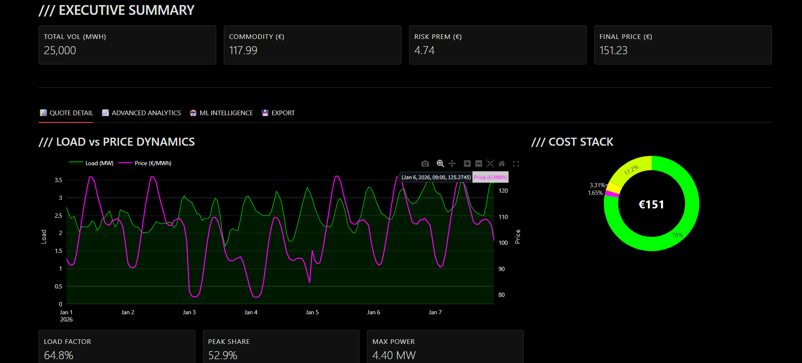
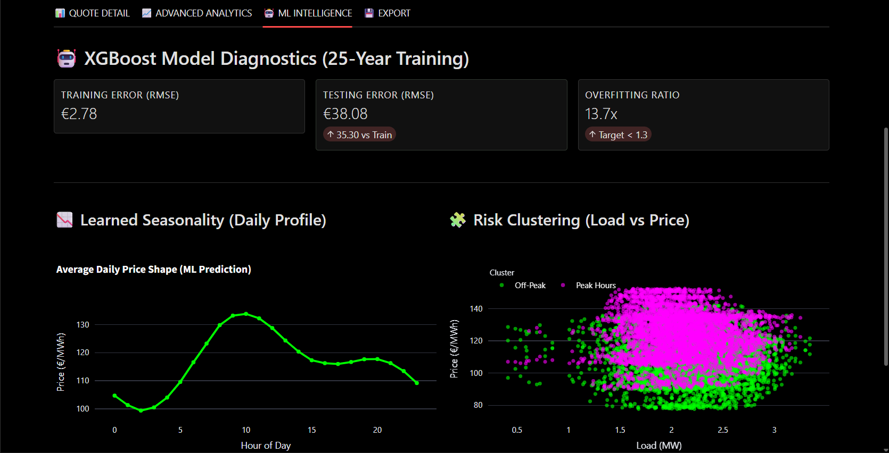
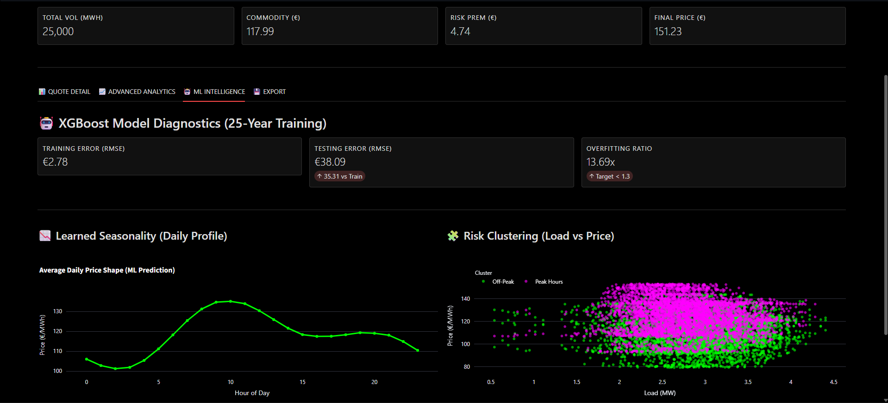
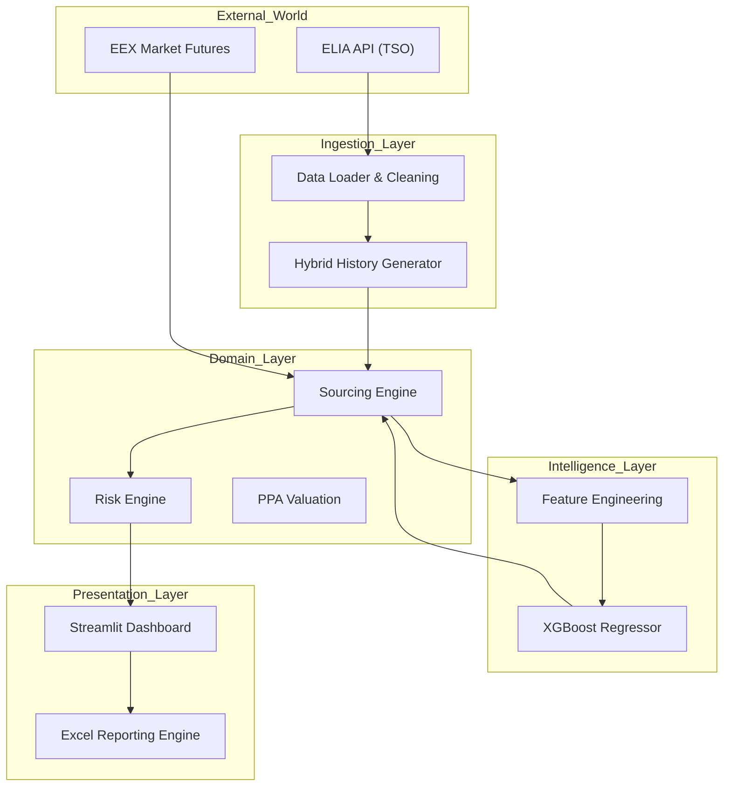

# Voltage Pricer – Enterprise Energy Pricing Engine

An industrial-grade pricing engine designed for B2B Power & Gas suppliers, bridging Wholesale Markets (EEX) and Retail Offers through **hybrid stochastic modeling and Machine Learning** grounded in real market data.

<p align="center">
  <a href="assets/PLOT6.png">
    
  </a>
</p>

<p align="center">
  <a href="assets/PLOT7.png">
    
  </a>
</p>

<p align="center">
  <a href="assets/PLOT8.png">
    
  </a>
</p>

---

## Table of Contents

- Executive Summary  
- System Architecture  
- Microservices Design  
- Data Flow Diagram  
- Quantitative Framework (The Math)  
- Machine Learning Forecasting (XGBoost)  
- Hourly Price Forward Curve (HPFC)  
- Profiling Cost Valuation  
- Volume Risk Premium  
- Renewable PPA Cannibalization  
- Technical Implementation  
- Data Ingestion Layer  
- Domain Logic Layer  
- Reporting Layer  
- Interface & UX  
- Installation & Deployment  
- Project Structure  

---

## 1. Executive Summary

**Voltage Pricer** is a Python-based valuation engine simulating the workflow of a Pricing Analyst at a major utility (e.g., TotalEnergies, Engie). Unlike simple arithmetic calculators, it implements a **bottom-up approach** to energy pricing, combining **market theory and observed reality**:

- **Real-Time Grid & Market Integration**  
  Connects to the ELIA (Belgian TSO) Open Data API to ingest historical spot prices and grid signals, ensuring the pricing logic is grounded in real-world market behavior.

- **Hybrid AI-Driven Seasonality**  
  Utilizes a Gradient Boosting Regressor (XGBoost) trained on a **hybrid historical dataset**:
  - Long-term synthetic data (2000–2014) to stabilize structural seasonality.
  - Real ELIA spot prices (2015–present) to capture modern volatility, negative prices, and crisis regimes.

- **Risk Quantification**  
  Explicitly computes Profiling Cost (Shape Risk) and Volume Swing Risk to protect supplier margins against consumption uncertainty.

---

## 2. System Architecture

The project adopts a **Hexagonal Architecture (Ports & Adapters)** to decouple business logic (Pricing / Risk) from infrastructure concerns (API / UI / Data Sources).

---

### 2.1 Microservices Design

The application is containerized and split into modular components:

- **Ingestion Service**  
  Handles external API calls (ELIA), data normalization, and resilience fallback.

- **Forecasting Service**  
  Manages the full lifecycle of the XGBoost model (hybrid training, inference, calibration).

- **Pricing Core**  
  Pure Python implementation of sourcing, profiling, and risk valuation formulas.

- **Presentation Layer**  
  Streamlit dashboard acting as the B2B Sales and Structuring front-end.

---

### 2.2 Data Flow Diagram



## 3. Quantitative Framework (The Math)

### 3.1 Machine Learning Forecasting (XGBoost)

The model predicts the **hourly price shape** using time-based explanatory variables and a **hybrid learning strategy**.

- **Objective**: Minimize RMSE on historical hourly prices  

- **Features**:  
  `Hour`, `DayOfWeek`, `Month`, `DayOfYear`, `IsWeekend`, `IsPeak`

- **Algorithm**: Gradient Boosting Trees (XGBoost)  
  - 300 estimators  
  - `max_depth = 8`  
  - Low learning rate for stability  

The hybrid dataset allows the model to learn:

- **Structural seasonality** from long-term synthetic history  
- **Real volatility regimes** from observed ELIA spot prices  

---

### 3.2 Hourly Price Forward Curve (HPFC)

The Hourly Price Forward Curve aligns the ML-generated hourly structure with a market forward level.

$$
HPFC_t = \hat{P}_t^{ML} + \left( P_{Market}^{Forward} - \mu\left(\hat{P}^{ML}\right) \right)
$$

Where:

- $\hat{P}_t^{ML}$ is the ML-predicted hourly price  
- $P_{Market}^{Forward}$ is the Cal forward baseload price  
- $\mu(\cdot)$ is the mean of the ML-generated curve  

This preserves the **shape learned from real market history** while matching the commercial forward price.

---

### 3.3 Profiling Cost Valuation

The profiling cost measures **shape risk**, i.e. the tendency to consume more electricity during structurally expensive hours.

$$
Cost_{Profiling} =\left(\frac{\sum_{t=1}^{8760} Load_t \times HPFC_t}{\sum_{t=1}^{8760} Load_t}\right)-\bar{P}_{Base}
$$

A positive value indicates a consumption profile more expensive than the flat baseload hedge.

---

### 3.4 Volume Risk Premium

To cover **swing risk** (volume deviation from forecast), a simplified option-like premium is applied.

$$
Premium = (Base + 5 \cdot \sigma_{spot}) \times SizeFactor(V)
$$

Where:

- $\sigma_{spot}$ is spot price volatility estimated from historical ELIA prices  
- $V$ is annual client volume  

---

### 3.5 Renewable PPA Cannibalization

For renewable PPAs (Solar / Wind), the fixed price is discounted to reflect capture effects and market correlation.

$$
P_{PPA} = (P_{Base} \times CR) - RiskBuffer
$$

This accounts for price cannibalization during periods of high renewable output.

---

## 4. Technical Implementation

### 4.1 Data Ingestion Layer

**File:** `src/ingestion/elia_client.py`

- Robust connector to `opendata.elia.be`  
- Retrieval of historical spot prices  
- Smart fallback using grid-consistent synthetic data in case of API failure  

---

### 4.2 Domain Logic Layer

**File:** `src/domain/ml_forecasting.py`

- Hybrid dataset construction (synthetic + real)  
- Automated model training and validation  
- Strict Python typing (validated by Pylance)  

---

### 4.3 Reporting Layer

**File:** `src/reporting/excel_export.py`

- Executive Summary tab  
- Cost Breakdown tab  
- Embedded native Excel charts  

---

## 5. Interface & UX

Trading-terminal aesthetic (**Dark Mode**, **Neon Accents**) built with **Streamlit** and **Plotly**.

- Load vs Price dual-axis chart  
- Seasonal heatmap (Hour × Month)  
- ML diagnostics (Train / Test RMSE, overfitting ratio)

---

## 6. Installation & Deployment

### Prerequisites

- Python 3.11+  
- Pip or Poetry  

---

### Clone & Install

```bash
git clone https://github.com/YOUR_USERNAME/Voltage-Pricer.git
cd Voltage-Pricer

py -m pip install pandas numpy scipy streamlit plotly xlsxwriter openpyxl xgboost scikit-learn requests
```

### Launch API

```bash
py -m uvicorn src.engine.api_server:app --reload --port 8000

```

### Launch UI


```bash
py -m streamlit run app.py

```

## 7. Project Structure

```text
Voltage-Pricer/                     # Project root
├── src/                            # Application source code
│   ├── core/                       # Global configuration
│   │   └── settings.py             # Market rules & constants
│   ├── domain/                     # Business logic layer
│   │   ├── pricing_models.py       # Sourcing & pricing logic
│   │   ├── risk_models.py          # Profiling & volume risk
│   │   ├── ppa_valuation.py        # Renewable PPA pricing
│   │   └── ml_forecasting.py       # XGBoost forecasting engine
│   ├── ingestion/                  # Data ingestion layer
│   │   ├── curve_generator.py      # Load profile generation
│   │   ├── market_data.py          # Market price feeds
│   │   └── elia_client.py          # TSO API connector
│   └── reporting/                  # Output & reporting
│       └── excel_export.py         # Excel quote generation
├── app.py                          # Streamlit UI entrypoint
├── pyproject.toml                  # Dependency management
└── README.md                       # Project documentation
```

## License

MIT License

Copyright (c) 2026

